In this assigment, I make Coffee Store with advance: HTML, CSS and Javascript.
I m Applying CSS Grid, Semantic Element, Responsive Website, etc.

Here's my deploy:
[Coffee Store](coffeestoreproject.netlify.app)
Here's my website: (noviairawati.site)

**Now, I want to share how to deploy your project**

###Deployment Prosess

####Netlify Sign Up Process & Connect Netlify to Github
1. Open "[netlify](https://app.netlify.com/)"

2. Clicking "Sign Up"

3. Choose "Sign Up with git Hub"

4. Enter "Username" and "password" > next Clicking "Sign in"

5. Then, Verify your device > Clicking "Verify"

6. All Done, your netlify is live

####Auto Deployement on Github with Netlify
1. Add New Site

2. Link to Your GitHub (or supported version-control tool of choice), then Clicking "Add A New Project"

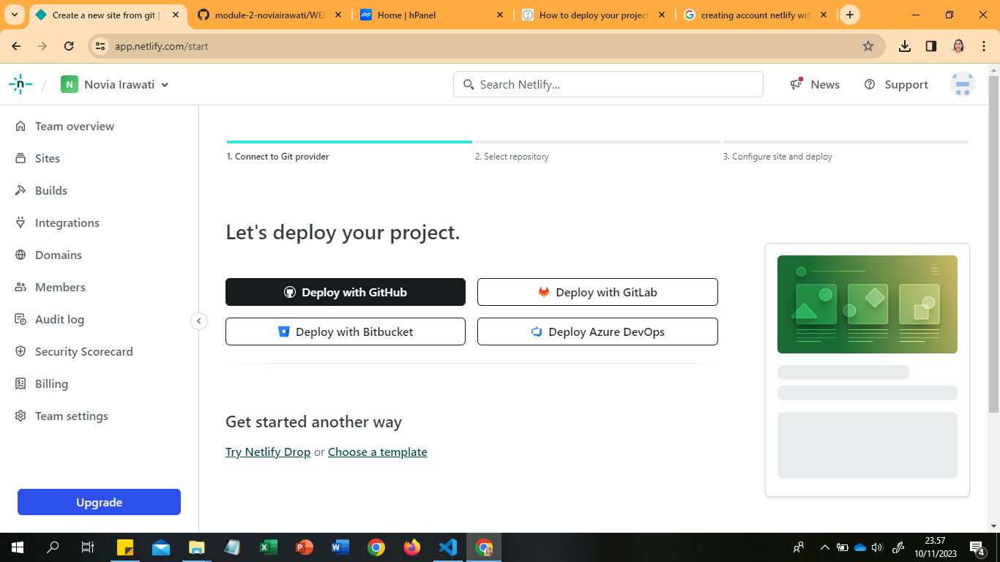

3. Authorize Netlify
It's time to authorized your Netlify and GitHub to connect each other. Clicking the "Authorized"
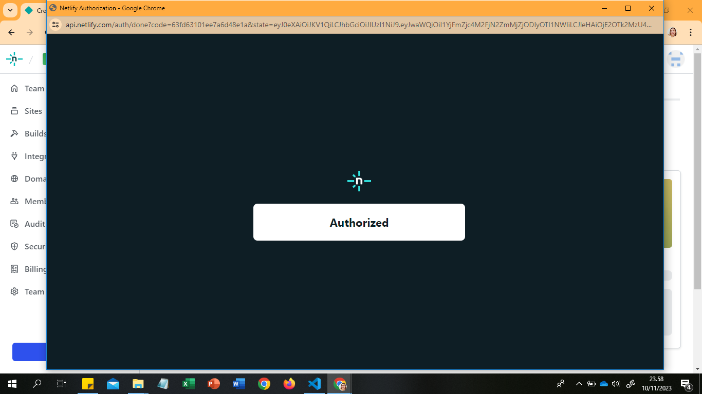

4. Select Your Repo
Now that you've connected Netlify and GitHub, you can see a list of your Git repos. Choose the repo you’d like to deploy from the list.

5. Configure Your Settings
click the "Deploying" button to continue.

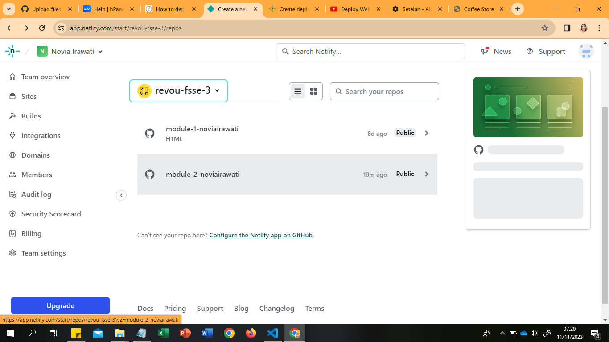
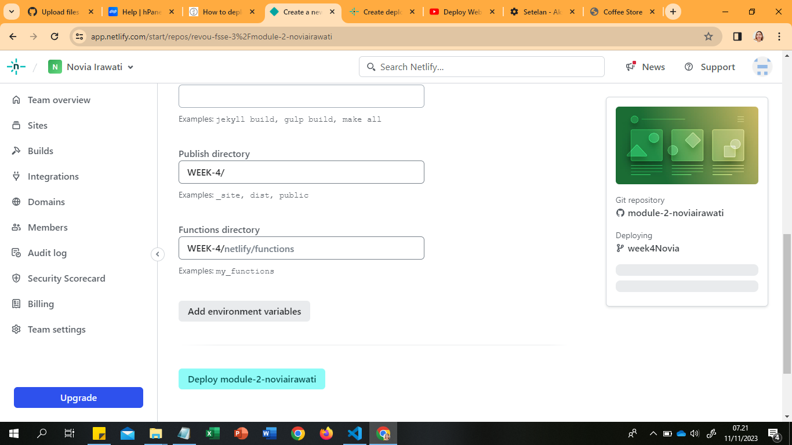
6. Build Your Site
Now it's time to sit back and relax. You did your part; let Netlify take care of the rest. It'll only take a minute.

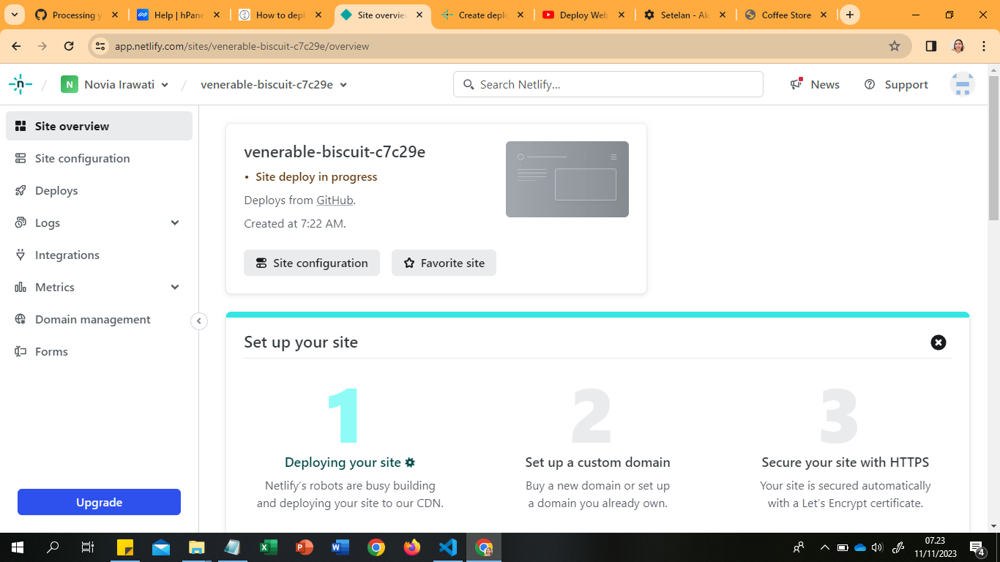

7. All Done
Once the build completes, your site is live! Head to the overview and you can see the URL of your newly published site.
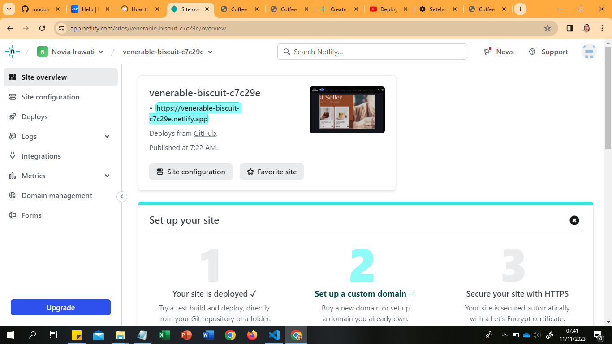

Netlify automatically generated a name for your site. Let's update that by visiting the settings tab and clicking "Change site name":
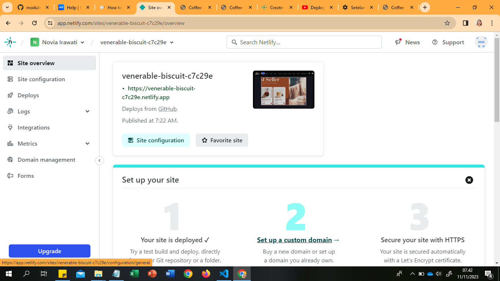

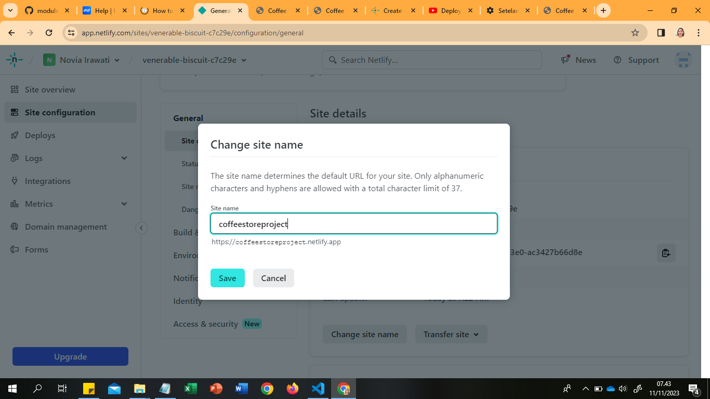

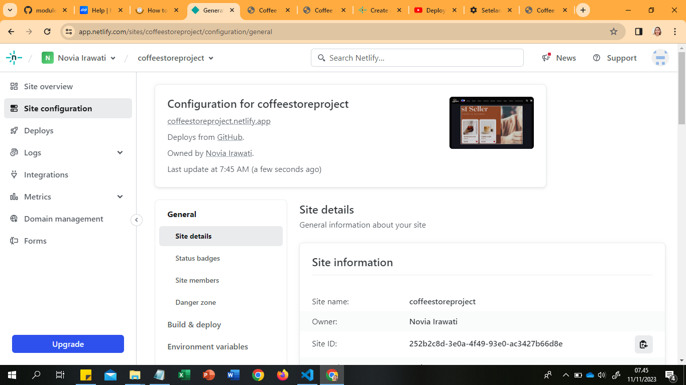

####How to Connect your Custom Domain
1. Inside of the Netlify dashboard, navigate to your domain settings and click “Add Domain Management”

2. Enter the name of your domain and click “Verify”.

3. After that has finished, click on the options menu next to your new domain and choose “Set up Netlify DNS”.

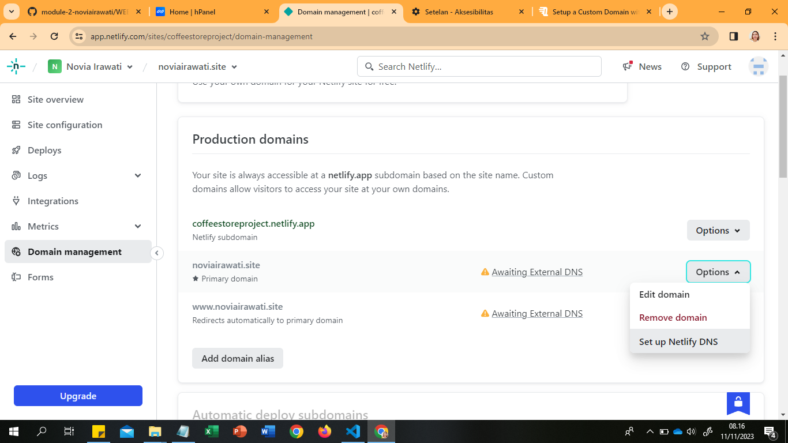

4. Follow the steps here by choosing “Verify”, then “Add Domain”, and “Continue”. Then when you get to the screen about domain name servers, copy those name servers.

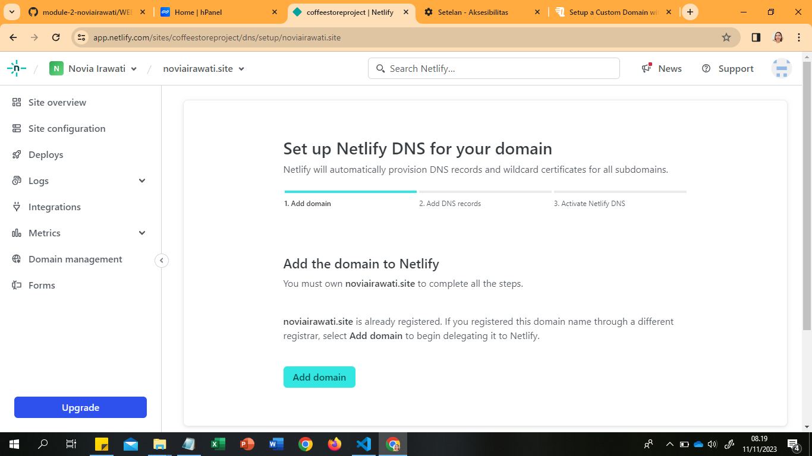

5. Then, in the dashboard where you bought your domain (mine is Namecheap), set the DNS to custom DNS and add the DNS names from Netlify.

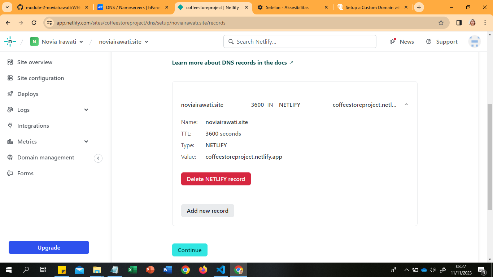

6. Then, in the dashboard where you bought your domain (Niaga Hoster), set the DNS to custom DNS and add the DNS names from Netlify > Click "Change" > and Then Click "Save"
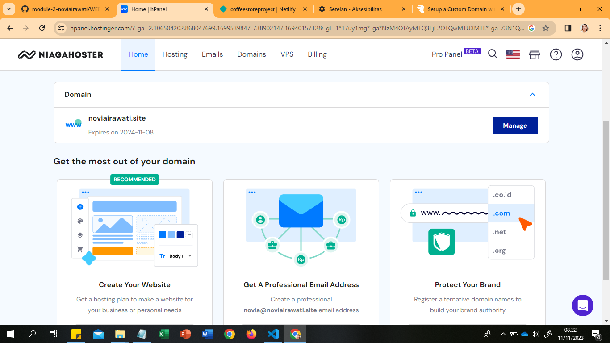
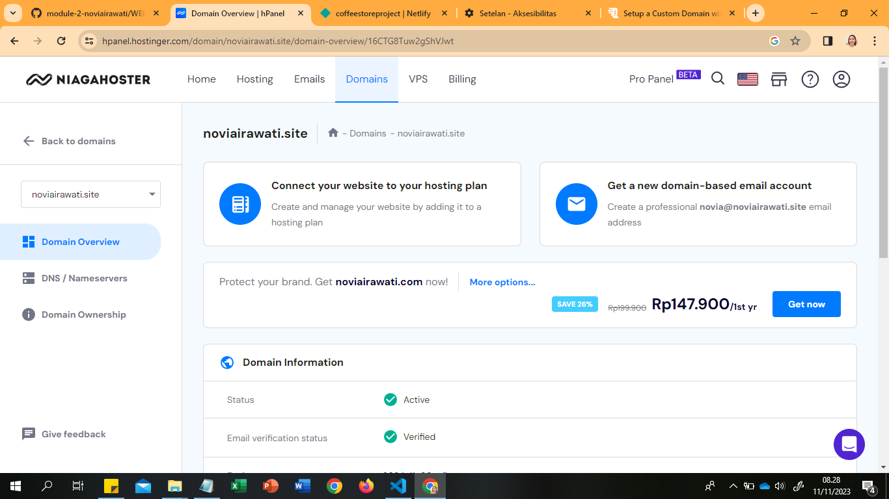

7. Click "Done" in Netlify
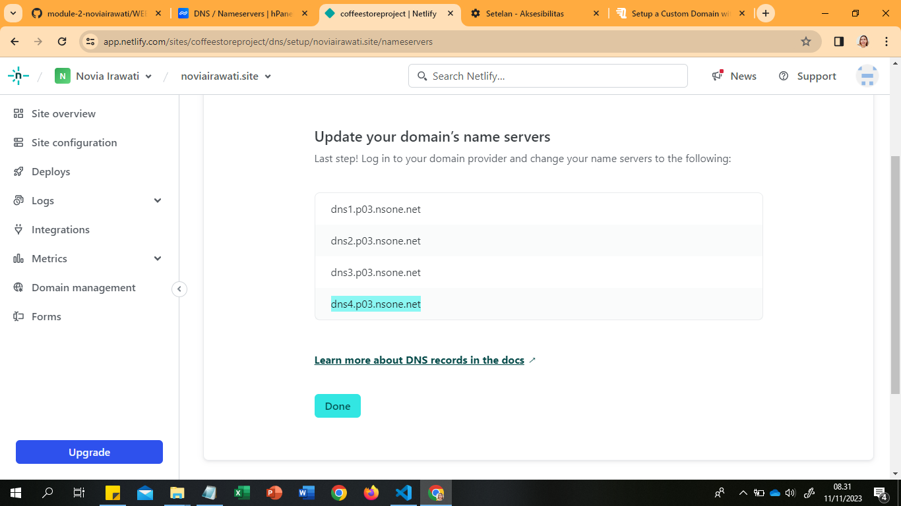

8. After that, you may need to wait a few minutes for the settings to propogate, you should eventually see the “Netlify DNS” tag associated with your domain name.
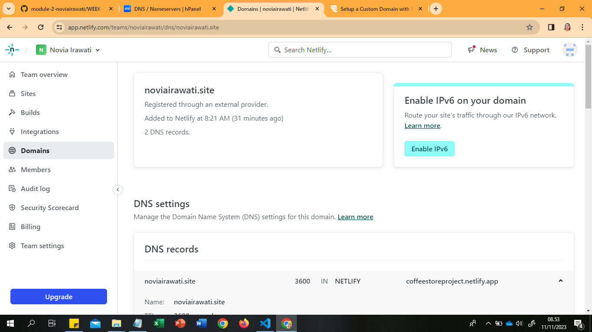
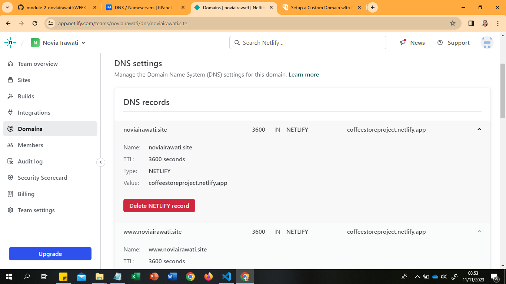
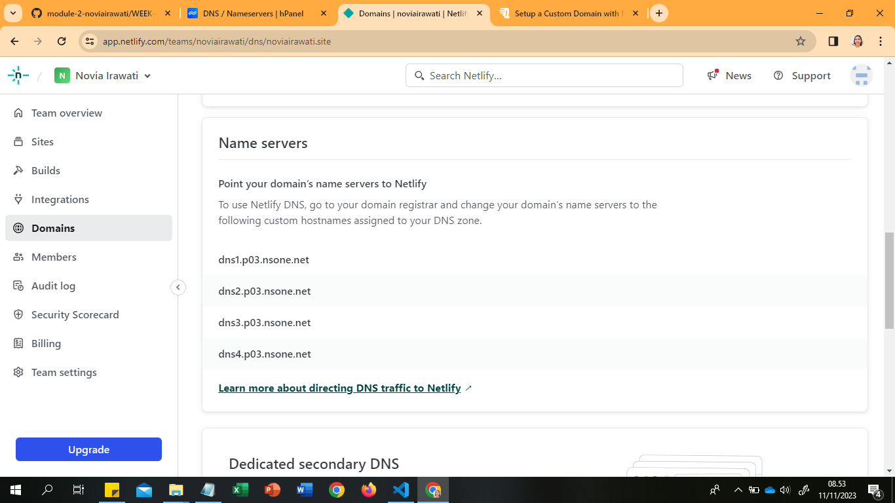

Now, this is the appearence of your website
