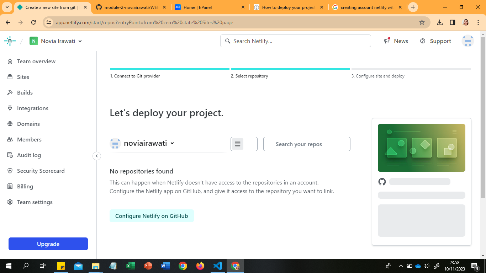
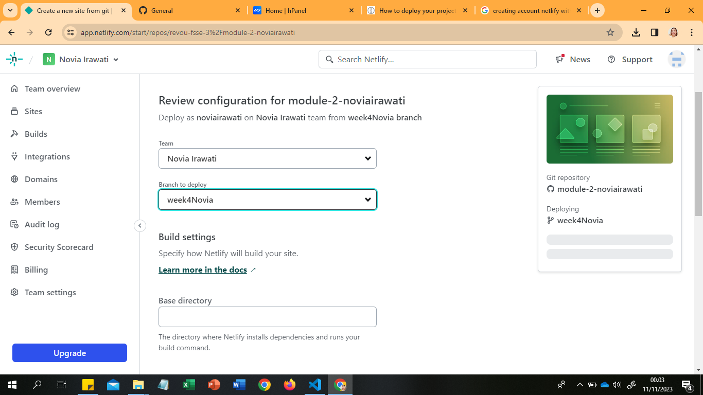

In this assigment, I make Coffee Store with advance: HTML, CSS and Javascript.
I m Applying CSS Grid, Semantic Element, Responsive Website, etc.

Here's my deploy:
[Coffee Store]()
Here's my website: noviairawati.site

**Now, I want to share how to deploy your project**

###Deployment Prosess

####Netlify Sign Up Process & Connect Netlify to Github
1. Open "[netlify](https://app.netlify.com/)"
2. Clicking "Sign Up"

3. Choose "Sign Up with git Hub"

4. Enter "Username" and "password" > next Clicking "Sign in"

5. Then, Verify your device > Clicking "Verify"

6. All Done, your netlify is live

####Auto Deployement on Github with Netlify
1. Add New Site

2. Link to Your GitHub (or supported version-control tool of choice), then Clicking "Add A New Project"

3. Authorize Netlify
It's time to authorized your Netlify and GitHub to connect each other. Clicking the "Authorized"

4. Select Your Repo
Now that you've connected Netlify and GitHub, you can see a list of your Git repos. Choose the repo you’d like to deploy from the list.

5. Configure Your Settings
click the "Deploying" button to continue.

6. Build Your Site
Now it's time to sit back and relax. You did your part; let Netlify take care of the rest. It'll only take a minute.
!

7. All Done
Once the build completes, your site is live! Head to the overview and you can see the URL of your newly published site.

Netlify automatically generated a name for your site. Let's update that by visiting the settings tab and clicking "Change site name":

